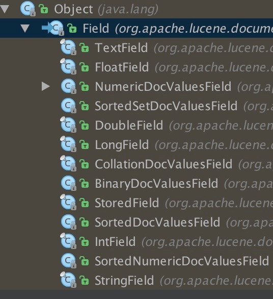

Field.Store.YES 或者 NO (存储域选项)
设置为YES表示把或这个域中的内容完全存储在文件中，方便进行还原
NO表示为不存储在文件中，但是可以被索引，此时内容无法还原

索引 ： 表示可以搜索到内容

Field.Index（索引域选项）

ANALYZED 进行分词和索引 ，适用于标题和内容
NOT_ANALYZED 不进行分词，如id,邮箱
ANALYZED_NOT_NORMS 进行分词但是不存储norms信息，这个norms中包括了创建索引的时间和权值等信息
NOT_ANALYZED_NOT_NORMS 既不进行分词也不存储norms信息
NO 不进行索引

索引建立步骤
1：创建Directory 
2：创建Writer
3：创建文档并且添加索引
4：查询索引的基础信息
5：删除和更新索引

服务器硬件的条件基本不需要对硬盘有多么大的操作。一般ssd就可以。io操作毕竟还是ssd较快。
lucene在进行优化的时候可以直接看源码进行。大部分情况下不需要进行优化。比如你要对lucene存储的索引进行优化，因为占用存储越来越大。但是请注意尽量不要去优化代码，请去申请加ssd挂载到服务器上。

搜索结果有排序
排序可以进行加权 5.0之前的版本是这样加权的。
doc.setBoost(Float float)
由于计算权重影响排序问题，而索引是根据单词进行索引，所以5.0的权重修改直接放在了Field中进行setBoost
如下示例：
Field field = new StringField("content","i love you", Field.Store.YES);
field.setBoost(1.5f);
document.add(field);

Luke是一个Lucene开发的需要的客户端。大家可以用起来。

日期和时间的存储

加权是一个人大数据或者是人为操作的因素，算法很多。但是如果是人为干预最好做好业务上的逻辑分析

IndexReader 和 IndexWriter 开关很消耗时间和资源

所以可以写成 __单例模式__ 。

同一生命周期中reader需要进行重新读取，writer在添加之后需要commit之后当reader再次读取的时候才会索引到。

直接reader删除会直接更新索引。而writer删除需要提交之后reader才会再次读取。

建议是在writer 进行删除。

